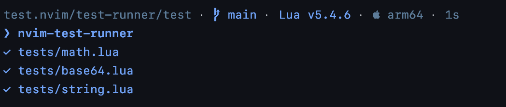

# test.nvim

A collection of tools and libs for testing neovim plugins.



## How it works

This project comes with an executable `nvim-test-runner` that does the following:
- Setups any dependencies that your plugin replies on, cloning them to `.tests` and adding them to vim runtimepath
- Probe your plugin for test files and run them in neovim headless mode
- Report the test results in a pretty format

## Usage

Create a file named `nvim-test-runner.json` in your plugin root directory

```json
{
    "test_dependencies": [
        {
            "url": "https://github.com/samsze0/utils.nvim"
        }
    ]
}
```

Create a test file `tests/math.lua`. By default, this plugin looks in the following locations:

- `tests/**/*.lua`
- `test/**/*.lua`
- `lua/tests/**/*.lua`
- `lua/test/**/*.lua`

```lua
-- Test math.abs
assert(math.abs(-5) == 5, "math.abs failed")

-- Test math.floor
assert(math.floor(5.7) == 5, "math.floor failed")

-- Test math.ceil
assert(math.ceil(5.3) == 6, "math.ceil failed")

-- Test math.sqrt
assert(math.sqrt(16) == 4, "math.sqrt failed")

-- Test math.pow
assert(math.pow(2, 3) == 8, "math.pow failed")

-- Test math.sin
assert(math.sin(math.pi / 2) == 1, "math.sin failed")

-- Test math.cos
assert(math.cos(math.pi) == -1, "math.cos failed")

-- Test math.tan
assert(math.tan(0) == 0, "math.tan failed")
```

Finally, run the test-runner

```shell
nvim-test-runner
```

The test runner would first download any external dependencies that your plugin relies on. For example, lets say my plugin depends on `utils.nvim`, the test runner would clone the repo to somewhere like `.test/external-dep/utils.nvim-862e7427cd888766d18ef9cf6ea1154d862fad61`.

Say if `https://github.com/samsze0/utils.nvim` now have a new version, when the test-runner is invoked, it first check what is the latest commit hash of the repo, and if it is different from the one that is currently cloned, it would update the repo to the latest commit hash, and would warn the user that the dependency has been updated.

If you are using [lua-language-server](https://github.com/LuaLS/lua-language-server), you might also want to all your plugin's dependencies to `.luarc.json`

```json
{
  "$schema": "https://raw.githubusercontent.com/LuaLS/vscode-lua/master/setting/schema.json",
  "runtime.version": "LuaJIT",
  "workspace": {
    "library": [
      "lua",
      "$VIMRUNTIME/lua",
      "${3rd}/luv/library",
      ".tests/external-dep/utils.nvim-xxx/lua"
    ],
    "checkThirdParty": false
  }
}
```

## License

MIT